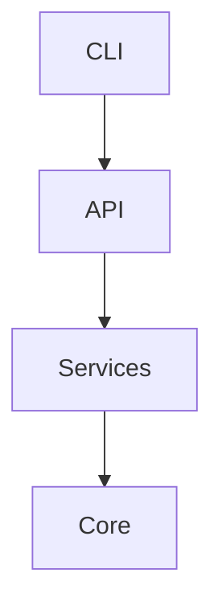

# Architecture Specification

> Generated by spec-gen v1.0.0 on 2026-03-25 23:11

## Purpose

This document describes the architectural patterns and structure of the system.

## Architecture Style

Layered architecture: CLI layer → API layer → service layer → core layer. This pattern separates
concerns and allows for better maintainability and scalability.

## Requirements

### Requirement: LayeredArchitecture

The system SHALL maintain separation between:
- CLI (Handles command-line interface interactions and user input)
- API (Provides endpoints for various operations and manages HTTP requests and responses)
- Services (Contains business logic and interacts with core components to perform specific tasks)
- Core (Contains the core functionality and components that are used across the application)

#### Scenario: LayerSeparation
- **GIVEN** a request from the presentation layer
- **WHEN** business logic is needed
- **THEN** the presentation layer delegates to the business layer
- **AND** direct database access from presentation is prohibited

### Requirement: SecurityModel

The system SHALL implement security via: Authentication and authorization are not explicitly mentioned in the provided data. It is uncertain if the system has any security measures in place.

#### Scenario: AuthenticatedAccess
- **GIVEN** an unauthenticated request
- **WHEN** accessing protected resources
- **THEN** access is denied

## System Diagram

## Layer Structure

### CLI

**Purpose**: Handles command-line interface interactions and user input
**Location**: `src/cli/commands/mcp.ts, src/cli/commands/view.ts`

### API

**Purpose**: Provides endpoints for various operations and manages HTTP requests and responses
**Location**: `src/api/run.ts, src/api/generate.ts, src/api/init.ts, src/api/drift.ts`

### Services

**Purpose**: Contains business logic and interacts with core components to perform specific tasks
**Location**: `src/core/services/mcp-handlers/utils.ts, src/core/services/config-manager.ts, src/core/services/llm-service.ts, src/core/services/chat-tools.ts`

### Core

**Purpose**: Contains the core functionality and components that are used across the application
**Location**: `src/core/analyzer/artifact-generator.ts, src/core/analyzer/call-graph.ts, src/core/analyzer/signature-extractor.ts`

## Data Flow

CLI command → API endpoint → service → core component → data processing → response. Data flows from
the user input through the CLI, to the API layer, then to the service layer, and finally to the core
components for processing. The results are then sent back through the layers to the user.

## External Integrations

| System | Purpose |
|--------|---------|
| OpenAI-compatible LLM APIs | External integration |
| Git | External integration |
| File system | External integration |
| HTTP | External integration |
